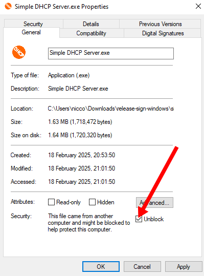

# Simple DHCP Server

[Download][releases]

This is a purely Python DHCP server that does not require any additional libraries or installs other that Python 3.

It was testet under Ubuntu 14 with Python and Windows 7. It does not use any operating system specific Python functions, so it should work when Python 3 works.

  
dhcpgui lists MAC address, IP address and host name.

This DHCP server program will assign IP addresses ten seconds after it received packets from clients. So it can be used in networks that already have a dhcp server running.

This Python DHCP server

- shows clients in the network
- lists IP address, Mac address and host name
- highlights recently refreshed/added clients
- assigns IP addresses 10 seconds later than usual DHCP servers
- remembers addresses in the `hosts.csv` file.
- can be configured to serve all DHCP options using Python

Contributions welcome!
If you find a bug, please open an [issue].

## Windows

You can install this software by downloading the [release][releases] named `Simple-DHCP-Server-Windows-X.Y.Z.zip` file.
Unpack the zip file, you will find an executable `.exe` file inside.

You might need to unblock the file:



## Linux

There are several ways to install this under Linux:

### QT

You can use the new QT GUI:

```sh
pip install simple-dhcp-server[qt]
```

Start:

```sh
sudo simple-dhcp-server-qt
```

### Tkinter

You can use the old Tkinter GUI:

```sh
sudo apt-get install python3 python3-tk
pip install simple-dhcp-server
```

Start:

```sh
sudo simple-dhcp-server-tk
```

## Pipx

Pipx makes installation even nicer because it isolated the app.

1. Install [pipx]
2. Start:

    ```sh
    sudo pipx run --spec simple-dhcp-server[qt] python-dhcp-server-qt   
    ```

[pipx]: https://pipx.pypa.io/stable/installation/

## Related Work

This program was created to find Raspberry Pis in the network.

- [Adafruit-Pi-Finder](https://github.com/adafruit/Adafruit-Pi-Finder) - finde deinen Raspberry Pi im Netzwerk
- [Angry IP](https://angryip.org/) (Windows)

## Changelog

These are the recent changes.
If a version is not released, yet, it can still show up.
You can view the [realeases on GitHub][releases].

### 1.0.3

- Sign Windows Executable

### 1.0.2

- Correct Install description
- Create a different layout for Windows

### 1.0.1

- Correct path for Windows release zip

### 1.0.0

- Add QT Release
- Build windows exe automatically
- Publish to PyPI
- Create GitHub Release
- rename `master` branch to `main`
- Renamed to "Simple DHCP Server"

### 0.9

- Add icon to exe file and application
- Add flatpak build information

### 0.8

- Make text field expandable
- Show error message if DHCP port cannot be accessed

### 0.7

- Prevent duplicate assignment of IP addresses
- Add sliders to the GUI

### 0.6

- Use a queue
- Run in Linux
- Add install description
- Add ability to bind to a fixed IP address

### 0.5

- Fix issue with delay worker

### 0.4

- Fix issue with delay worker
- Add license

### 0.3

- Also show old values
- Random IP assignment when address space is full

### 0.2

- Add .exe file
- Add width and height

### 0.1

- Mark new entries as yellow
- Initial release

## New Releases

When the source code is changed, create a new release.

1. Log the changes: Edit the Changelog Section in

    - `README.md`
    - `python_dhcp_server/flatpak/io.github.niccokunzmann.python_dhcp_server.xml`

    ```sh
    git log # find changes
    git add README.md
    git commit -m"log changes"
    ```

2. Create a new tag

    ```sh
    git tag 1.0.3
    git push origin 1.0.3
    ```

3. Head over to [the Flathub metadata](https://github.com/niccokunzmann/io.github.niccokunzmann.python_dhcp_server/)
   and create a new release.

[releases]: https://github.com/niccokunzmann/python_dhcp_server/releases
[issue]: https://github.com/niccokunzmann/python_dhcp_server/issues
