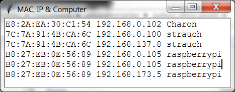

Python DHCP Server
------------------

[Download](https://github.com/niccokunzmann/python_dhcp_server/releases)

This is a purely Python DHCP server that does not require any additional libraries or installs other that Python 3.

It was testet under Ubuntu 14 with Python and Windows 7. It does not use any operating system specific Python functions, so it should work when Python 3 works.

  
dhcpgui lists MAC address, IP address and host name.

This DHCP server program will assign IP addresses ten seconds after it received packets from clients. So it can be used in networks that already have a dhcp server running.

Contributions welcome!

Related Work
------------

- [Adafruit-Pi-Finder](https://github.com/adafruit/Adafruit-Pi-Finder) - finde deinen Raspberry Pi im Netzwerk
